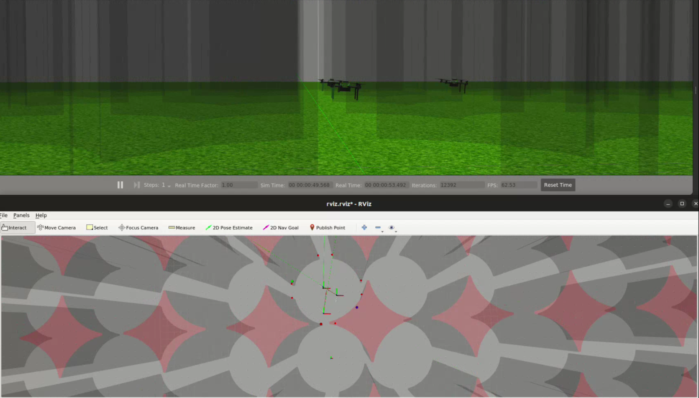

# Multi-Agent-Aerial-Systems
This repository contains three projects for the [Multi Robot Aerial Systems course](https://cw.fel.cvut.cz/b231/courses/mrs/start). The projects focus on practical implementation of control and estimation algorithms for robots, using a singularity software container with ROS for simulation.



## Project 1: Multirotor UAV control and state estimation
This project develops control and state estimation algorithms for multirotor UAVs. It implements a PID controller with a feedforward term and integrates a Linear Kalman Filter to enhance UAV's position measurements.

Run the simulation with

```
cd Multirotor_UAV_control_and_state_estimation/simulation
./run_simulation.sh
```

## Project 2: Centralized robot formation control
This project develops centralized formation control and planning algorithms for multirotor UAVs. It includes formation-reshaping planning, multilateration method for pose estimation, and mission logic to direct the UAV formation towards a mobile ground robot.

Run the simulation with

```
cd Centralized_robot_formation_control/simulation
./run_simulation.sh
```

## Project 3: Decentralized robot swarm control
This project focuses on sensor-driven decentralized control in multi-agent systems. It implements self-organizing navigation behaviors and the Boids model for simulating flocking behavior, allowing agents to exhibit collective behaviors while navigating autonomously.


Run the simulation with

```
cd Decentralized_robot_swarm_control/simulation
./run_hunt_the_robot.sh
```

Note that a singularity image is required for any of the simulation (~4Gb), which can be downloaded from any of the project's folders with 
```
./simulation/download.sh
```